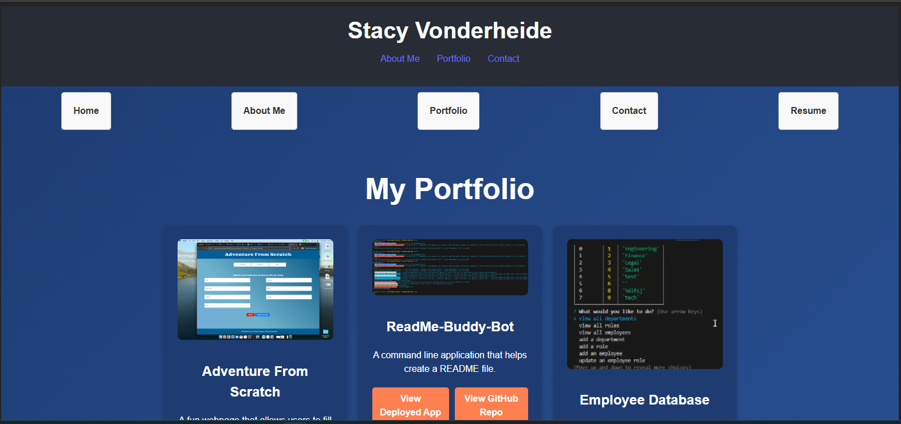

## SV_Tech

## Description
This is my personal online portfolio, built with React and Vite, showcasing my skills, projects, and experience as a Full Stack Developer. The portfolio provides insight into my background, technical expertise, and work samples, along with ways to contact me.

## Table of Contents
- [Installation](#installation)
- [Usage](#usage)
- [Contributing](#contributing)
- [Tests](#tests)
- [License](#license)
- [Questions](#questions)

## Installation
1. Clone the repository:git clone  <https://github.com/slvonderheide/SV-Tech>
2. Navigate to the project directory:cd React Portfolio/src
3. Install dependencies:npm install
4. Start the development server: npm start

## Usage
Vite, HTML, CSS, JavaScript, React, NOde.js, GitHub, VS Code, ChatGPT

## Contributing
Thank you for your interest in contributing! Since this is my personal portfolio, contributions are generally not required. However, if you notice a bug or have a suggestion for improvement, feel free to contact me.

## Tests
"Run the following command to execute tests: npm test. Make sure all tests pass before submitting any changes."

## License
This project is licensed under the MIT License.

## Questions
If you have any questions, feel free to reach out to me:
- GitHub: [slvonderheide](https://github.com/slvonderheide)
- Email: slvonderheide@gmail.com
        
## Link

## Images 
